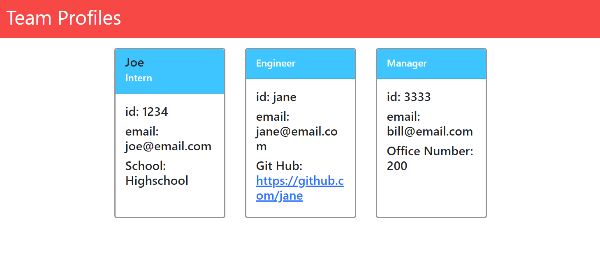

# Team-Profile-generator

## Description
This project was made to demonstrate simple unit testing with jest, as well as utilizing fs and inquirer

## Installation
npm install must be used before the launching this program

## Usage
enter node index.js into the terminal.
Then you will be saked a series of questions about the employee you want to add,
After all the questions, you will be asked if you would like to add another employee, if yes the questions will repeat.
If answered no, the webpage will be generated based on your responses.

    ```md
    
    ```

## License
This project is unnder the MIT Liscense
---

## Tests
The five tests located in the test folder simply check to make sure the get functions of 
each of their respective classes are working properly.
If you have installed the npm packeges, simpy run npm test followed by the file you wish to test.

